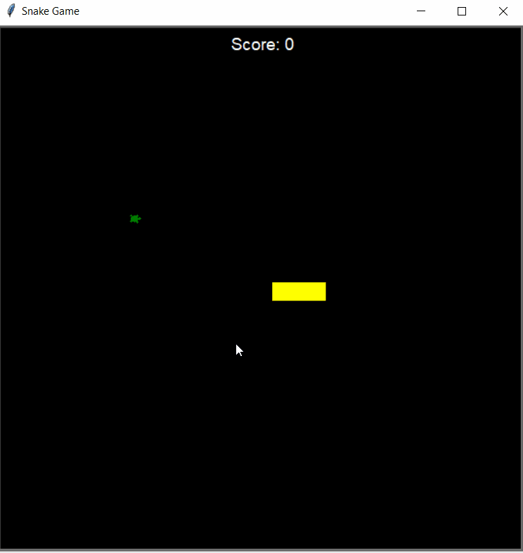

# Day 20 and 21 - Build the Snake Game Part 1 & 2: Animation, Coordinates, Inheritance & List Slicing
## Concepts Practised in Day 20
- Screen Setup and Creating a Snake Body
- Animating the Snake Segments on Screen
- Create a Snake Class & Move to OOP
- How to Control the Snake with a Keypress
## Concepts Practised in Day 21
- Class Inheritance
- How to Slice Lists & Tuples in Python
## Snake Game

