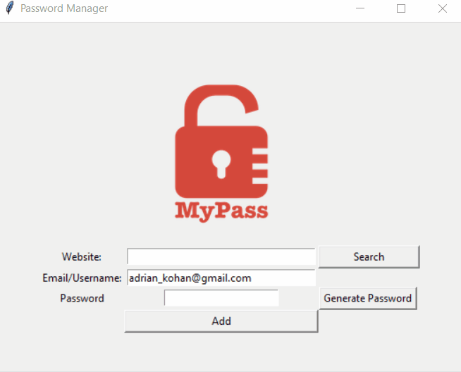

# Day 29 & 30 - Building a Password Manager GUI App with Tkinter: Errors, Exceptions and JSON Data
## Concepts Practised in Day 29
- Working with Images and Setting up the Canvas
- Use grid() and columnspan to Complete the User Interface
- Saving Data to File
- Dialog Boxes and Pop-Ups in Tkinter
- Generate a Password & Copy it to the Clipboard
## Concepts Practised in Day 30
- Catching Exceptions: The try catch except finally Pattern
- Raising Exceptions
- IndexError Handling
- KeyError Handling
- Write, read and update JSON data in the Password Manager
## Password Manager 

