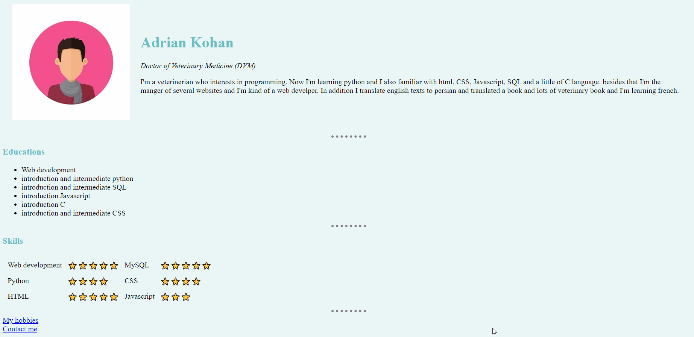

# Day 41 - Introduction to HTML
## Concepts Practised
- The Anatomy of an HTML Tag
- HTML Boilerplate
- How to Structure Text in HTML
- HTML Lists
- HTML Image Elements
- HTML Links and Anchor Tags
# Day 42 - Intermediate HTML
## Concepts Practised
- HTML Tables
- Using HTML Tables for Layout
- HTML Forms
- Create a Contact Me Form
# Day 43 - Introduction to CSS
## Concepts Practised
- Inline CSS
- Internal CSS
- External CSS
- How to Debug CSS Code
- The Anatomy of CSS Syntax
- CSS Selectors
- Classes vs. Ids
## HTML Website Using CSS

