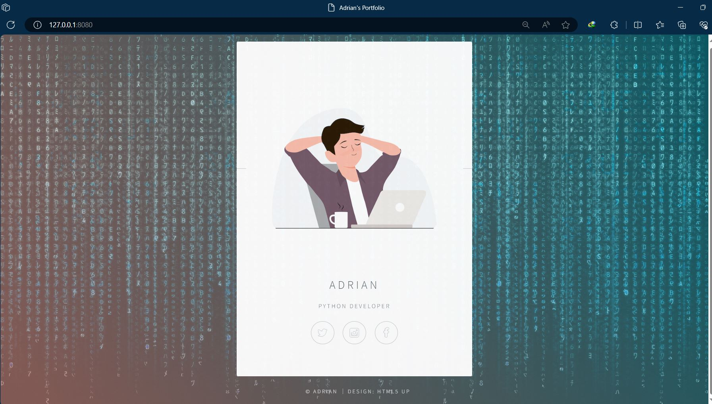

# Day 56 - Rendering HTML/Static Files and Using Website Templates
## Concepts Practised
- Rendering HTML Files with Flask
- Serving Static Files using Flask
- Use Website Templates to Speed Up Web Development
## Name Card Website

